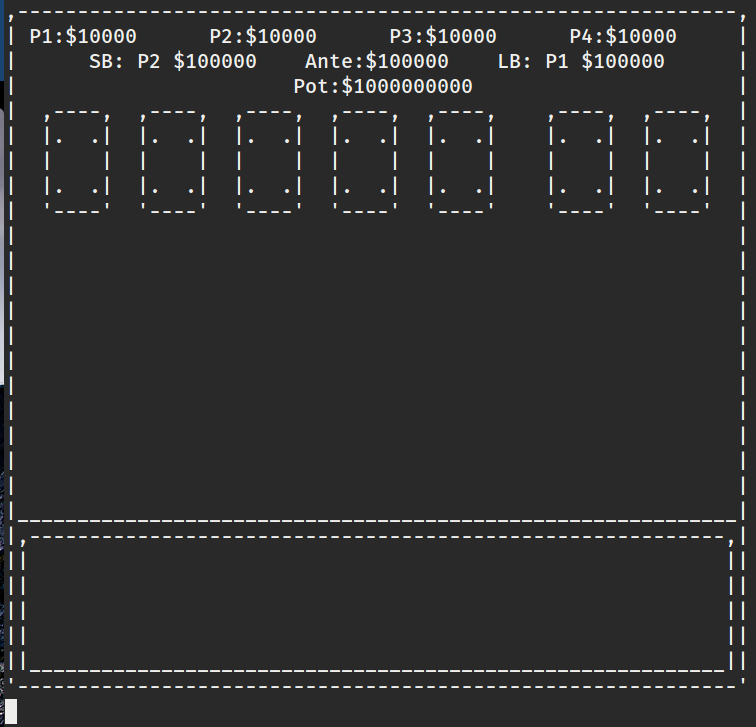
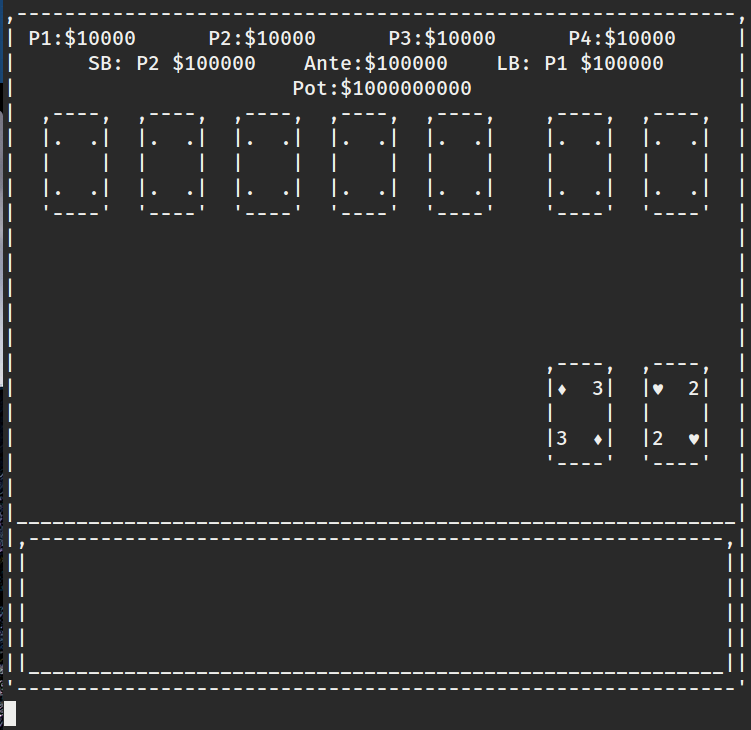
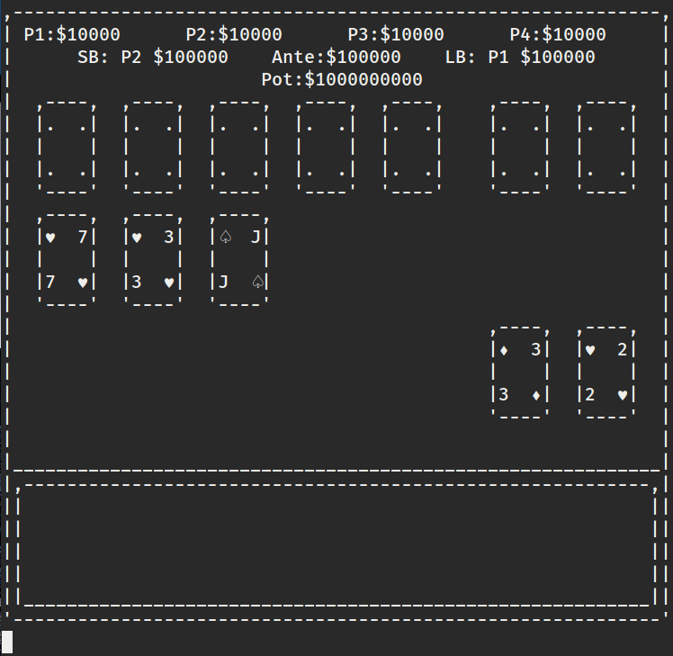
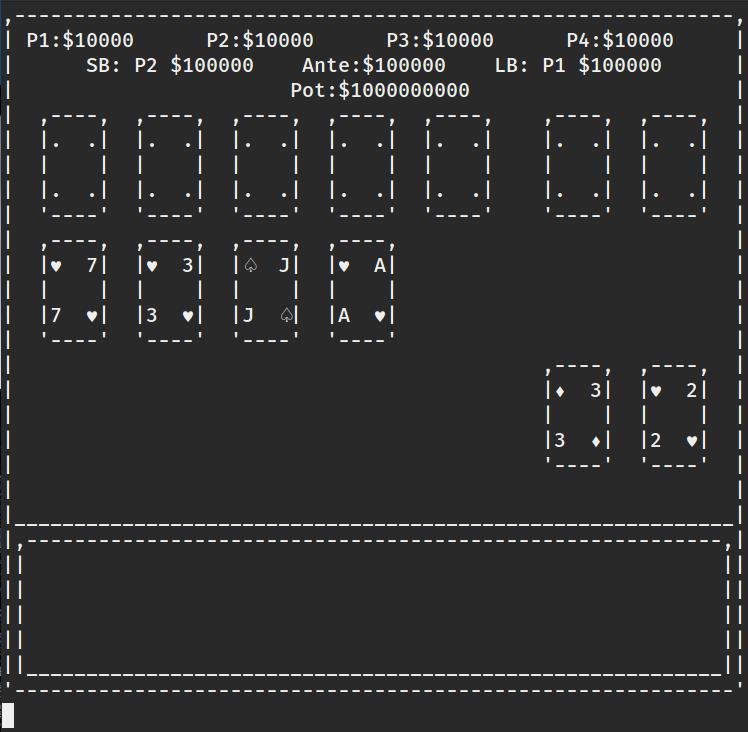
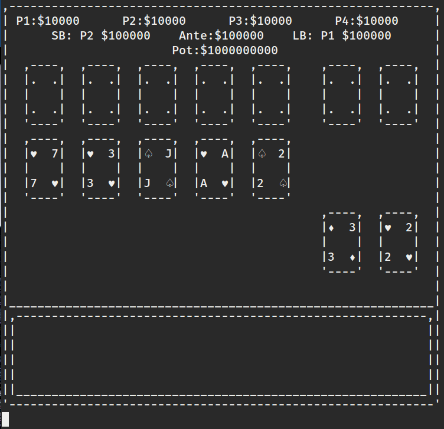
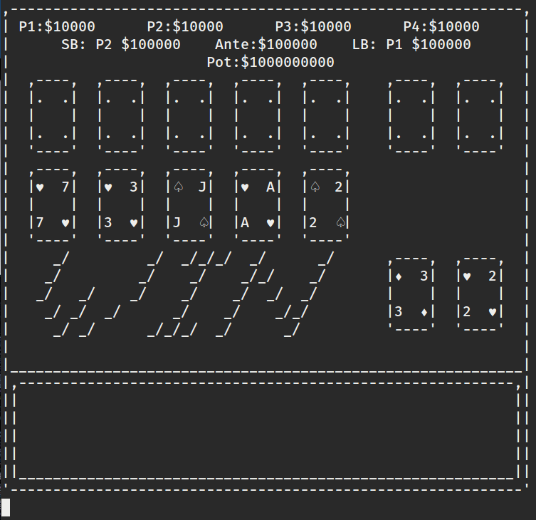
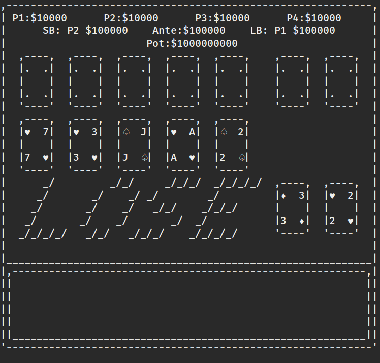

# UTF-8 Texas Hold'em
A c++ program to play Texas Hold'em against 3 computer players using UTF-8 characters to
draw the user interface. UTF-8 is required to play this in your console.

### 2016-07-07 Screen Shots
#### Ante
The logic for drawing the winning row is implemented, hence the cards with . instead of values. This row will be blank After the winning logic is implemented. At the win screen, the cards involved in the winning hand will be bumped up to the winning row, with the winners Showdown cards at the far right.
  

#### PreFlop

#### Flop

#### Turn

#### River

#### Winning Screen sans the Winning Row

#### Losing Screen sans the Winning Row

